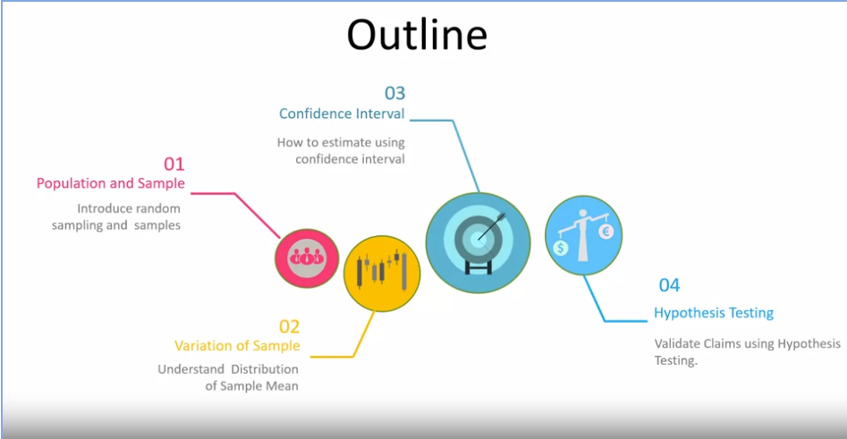

[MUSIC] Hello everyone,
welcome back to the course. In previous topic,
we have discussed random variables. We know that, when doing financial
analysis, identifying important variables is important in helping us making
better predictions and decisions. We have also learned the distribution
of random variables. We learned how to apply normal distribution to model a stock return, and evaluate the risk of extreme events. In this topic, we will explain statistical inference, which is a core part of statistics. In financial analysis, we're concerned about characteristics of some targets called a population. For example, we want to make use of
historical data of a couple years, called sample, to estimate the real
mean return of some private equity funds. Sometimes, we also want
to testify some claims. For example,
if the fund managers claim that their investment strategy can
generate 30% yearly return, we have to validate this claim
using data of the last 20 years. 
> These two applications are
typical tasks of statistical inference to infer the promptings
of interesting targets. 

We are going to explore this topic
in the following four videos. First, we will talk about population,
samples and random sampling. In the second video, we will find
out the distribution of sample mean. In the third video, we will learn
how to use confidence interval to estimate population mean, for
example, the average data return. In the last video, hypothesis testing,
will be introduced and applied in validating some
claims about the mean return.